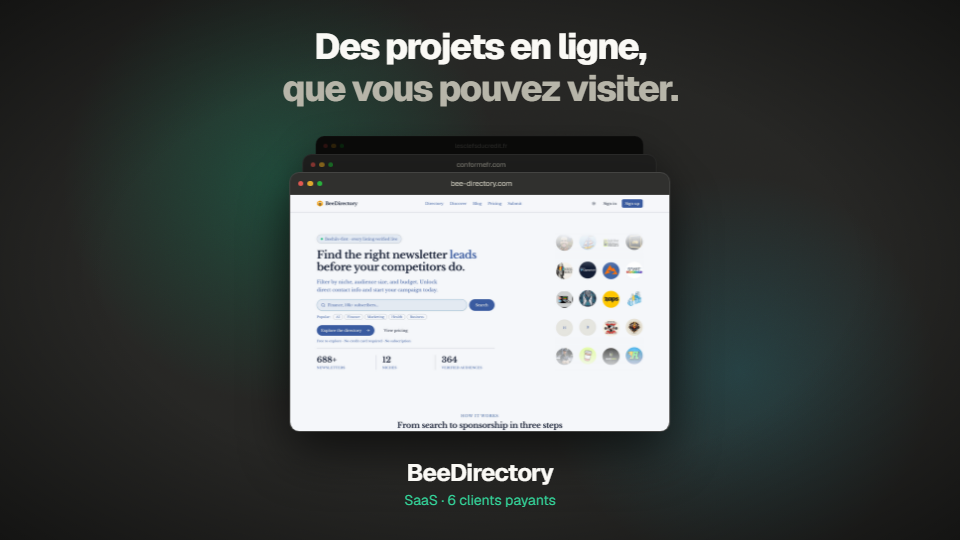

# TeeboStudio — vidéo de présentation

Vidéo motion design de 36 secondes pour [TeeboStudio](https://teebostudio.fr), studio web à Bordeaux. Elle est écrite en code avec [Remotion](https://www.remotion.dev) : la même composition React sort en trois formats, deux thèmes et deux langues, sans montage.



**Télécharger les vidéos :** [derniers rendus (MP4)](../../releases/tag/video)

Le déroulé plan par plan et les choix de contenu sont dans [BRIEF.md](BRIEF.md).

## Formats

| Composition | Dimensions | Usage |
|---|---|---|
| `Landscape` | 1920 × 1080 | teebostudio.fr, YouTube, LinkedIn |
| `Square` | 1080 × 1080 | fil LinkedIn, Instagram |
| `Vertical` | 1080 × 1920 | Reels, Shorts, stories |

Chaque composition existe en quatre variantes, désignées par un suffixe : `Light` pour le thème clair, `En` pour l'anglais (`Landscape`, `LandscapeLight`, `LandscapeEn`, `LandscapeLightEn`). Toutes font 1 080 images à 30 images par seconde, sans son.

## Stack

| Brique | Choix |
|---|---|
| Rendu | Remotion 4 (React 19) |
| Polices | Geist, Geist Mono et Caveat, via `@remotion/google-fonts` |
| Publication | GitHub Actions, dans la release `video` |

## Organisation du code

| Fichier | Rôle |
|---|---|
| `src/Root.tsx` | Déclare les compositions (format × thème × langue) |
| `src/Video.tsx` | Les sept plans, la chronologie (`PLANS`) et la mise en page selon le format (`useLayout`) |
| `src/TsMark.tsx` | Le monogramme « TS » en relief du plan d'ouverture |
| `src/content.ts` | Tous les textes, en français et en anglais |
| `src/theme.ts` | Les couleurs des thèmes sombre et clair |
| `render.mjs` | La liste des vidéos à rendre |
| `public/` | Captures des réalisations et favicon du témoignage |

### Pour changer…

| Quoi | Où |
|---|---|
| Un texte, un prix, un projet, le témoignage | `src/content.ts` (les deux langues) |
| La durée d'un plan | `PLANS` en haut de `src/Video.tsx` ; les plans suivants se décalent tout seuls |
| Une couleur | `src/theme.ts` |
| Une capture de réalisation | remplacer le fichier dans `public/`, au format 16:10 |
| Les vidéos rendues | `render.mjs` |

## Travailler en local

Il faut [Node.js](https://nodejs.org) 22 ou plus récent et [pnpm](https://pnpm.io). Aucune variable d'environnement.

```bash
pnpm install
pnpm studio          # aperçu dans le navigateur
pnpm render          # toutes les vidéos, dans out/
pnpm render:site     # les quatre vidéos paysage du site
pnpm render:social   # carré et vertical, en français et en anglais
```

## Mise à jour du site

À chaque modification poussée sur `main`, GitHub Actions rend les vidéos et les publie dans la release `video`. Le site n'y lit rien directement : les quatre fichiers `teebostudio-16x9*.mp4` sont à copier dans `public/videos/` du repo [Teebostudio](https://github.com/TeeBo8/Teebostudio), en changeant leur nom (`teebostudio-2026-…`) pour contourner le cache.

## Règles du projet

- Uniquement des faits vérifiables : prix publics du site, chiffres des études de cas, témoignage réel.
- En paysage, rien d'important dans les 150 pixels du haut et du bas : le site recadre la vidéo en 21:9 sur grand écran.
- Les textes français et anglais gardent le même ordre et le même nombre d'éléments.
